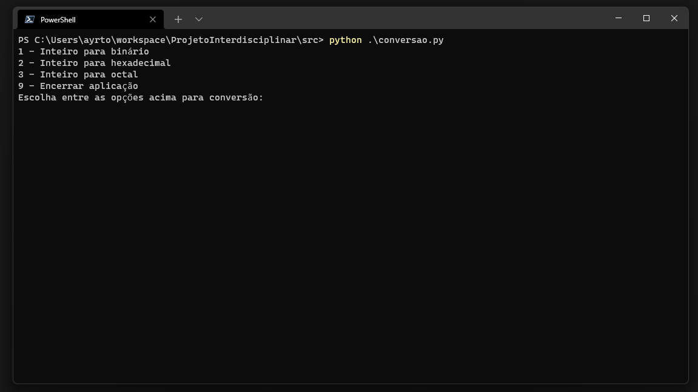
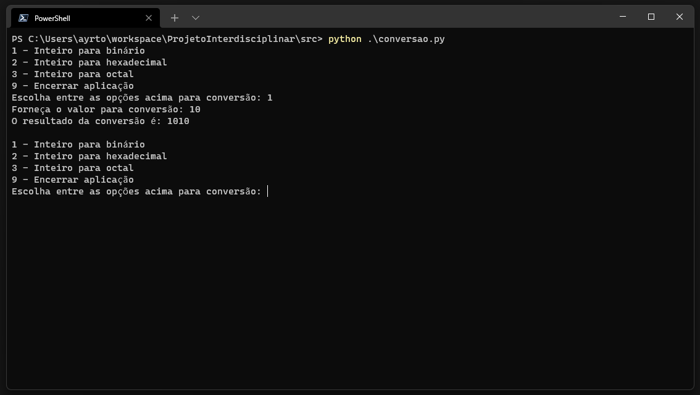
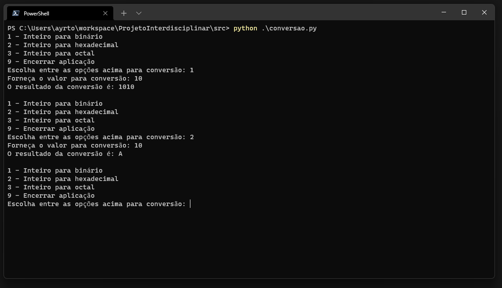
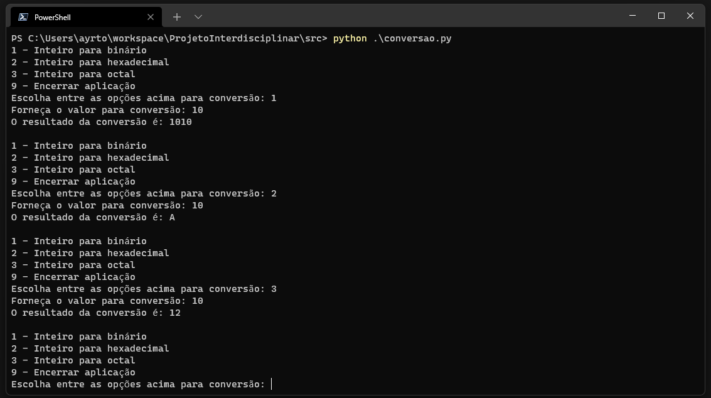

# Projeto Interdisciplinar
Projeto interdisciplinar cruzeiro do sul 2022.

O projeto utiliza python usando console como forma de interação com o usuário.

Para utilização executar em linha de comando: python conversao.py

As fontes de pesquisa utilizadas foram:

https://en.wikipedia.org/wiki/Octal
https://en.wikipedia.org/wiki/Binary_number
https://en.wikipedia.org/wiki/Hexadecimal

A ferramenta utilizada para conferencia dos valores:

https://www.rapidtables.com/convert/number/binary-to-decimal.html

# Como usar

Ao executar o comando "python conversao.py" deverá aparecer o menu abaixo:

Ao utilizar a opção 1 será solicitado um número inteiro na base 10 para conversão em binário

Ao utilizar a opção 2 será solicitado um número inteiro na base 10 para conversão em hexadecimal

Ao utilizar a opção 3 será solicitado um número inteiro na base 10 para conversão em octal

Ao utilizar a opção 9 o sistema deverá fechar.

Se qualquer outro número ou letra for utilizado o sistema solicitará novamente que o usuário escolha uma opção.