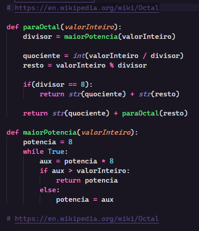

# Projeto interdisciplinar cruzeiro do sul 2022.

## Índice

[ComoUsar][Como usar]

# Como usar

Ao executar o comando "python conversao.py" deverá aparecer o menu abaixo:

## Conversão de base 10 para base 2
Ao utilizar a opção 1 será solicitado um número inteiro na base 10 para conversão em binário.

Fonte: https://en.wikipedia.org/wiki/Binary_number

## Conversão de base 10 para base 16
Ao utilizar a opção 2 será solicitado um número inteiro na base 10 para conversão em hexadecimal

Fonte: https://en.wikipedia.org/wiki/Hexadecimal

## Conversão de base 10 para base 8
Ao utilizar a opção 3 será solicitado um número inteiro na base 10 para conversão em octal

Fonte: https://en.wikipedia.org/wiki/Octal

Ao utilizar a opção 9 o sistema deverá fechar.

Se qualquer outro número ou letra for utilizado o sistema solicitará novamente que o usuário escolha uma opção.

# Sobre o fonte

## Código do menu

Na primeira parte do código eu crio um dicionário onde: 
A <b>chave</b> é a opção que deverá ser selecionada no menu. 
O <b>valor</b> é a função que deverá ser executada quando a opção for escolhida.

Em seguida crio a função <b>mostrarMenu</b> que é responsável por mostrar as opções disponíveis.

Após a criação da função inicializo a variável escolha com '-1' para que ela não esteja entre as opções e entre no while.

Dentro do while chamo a função <b>mostrarMenu</b>. 
Solicito que o usuário escolha uma das opções. 
Se a escolha for <b>9</b> encerro o processo. 
Se a escolha estiver entre as opções possíveis executo a função associada a escolha.

## Código de conversão em binário

O código da conversão em binário é uma função recursiva que calcula o quociente da divisão entre o valor recebido como parâmetro e o número 2. 
Caso o quociente seja 0 ele retorna '1'. 
Em seguida calcula o resto da mesma divisão feita anteriormente. 
Initializa a variavel atual com o valor '0' e se o resto for maior que zero substitui o valor por '1'. 

Por fim retorna recursivamente a concatenação do cálculo binário do quociente mais o cálculo binário já realizado.

## Código de conversão em hexadecimal

O código da conversão em hexadecimal possui dois métodos. 
O primeiro método calcula o hexadecimal. 
O segundo método substitui o valor calculado pelo caracter respectivo. 
Similar a conversão para binário, a conversão para hexadecimal é uma série de divisões porém, dessa vez, por 16.

## Código de conversão em octal

A conversão em octal é talvez a mais complexa. 
Primeiro devemos identificar por qual número faremos a divisão do valor recebido como parâmetro. 
Para isso o método <b>maiorPotencia</b> calcula o maior múltiplo de 8 que seja menor que o valor passado por parâmetro. 
Este valor então é utilizado como divisor do valor a ser convertido. 
O quociente dessa divisão é por fim concatenado com o resto caso o divisor seja 8. 
Ou ele será concatenado com o mesmo cálculo feito para o valor do resto.

# Fontes

As fontes de pesquisa utilizadas foram: 
https://en.wikipedia.org/wiki/Octal 
https://en.wikipedia.org/wiki/Binary_number 
https://en.wikipedia.org/wiki/Hexadecimal

A ferramenta utilizada para conferencia dos valores: 
https://www.rapidtables.com/convert/number/binary-to-decimal.html
