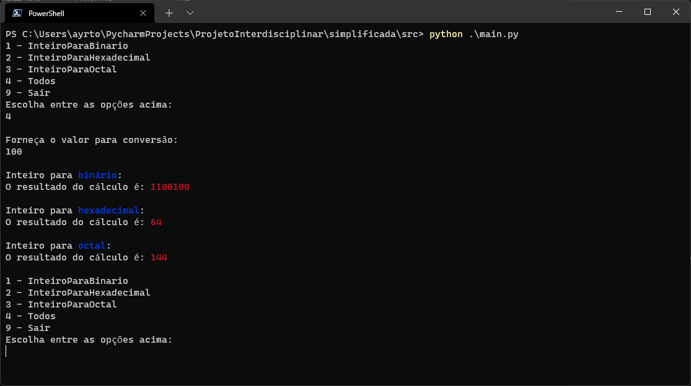

# Projeto interdisciplinar cruzeiro do sul 2022.

### Opção 1 converter números inteiros na base 10 para números binários, hexadecimais e octais.
<br>


# Como usar

Ao executar o comando `python src/main.py` deverá aparecer o menu abaixo:

## Menu


## Conversão de base 10 para base 2
Ao utilizar a `opção 1` será solicitado um número inteiro na base 10 para conversão em binário.


Fonte: https://en.wikipedia.org/wiki/Binary_number

## Conversão de base 10 para base 16
Ao utilizar a `opção 2` será solicitado um número inteiro na base 10 para conversão em hexadecimal


Fonte: https://en.wikipedia.org/wiki/Hexadecimal

## Conversão de base 10 para base 8
Ao utilizar a `opção 3` será solicitado um número inteiro na base 10 para conversão em octal


Fonte: https://en.wikipedia.org/wiki/Octal

## Opção 4 Todos

Ao utilizar a `opção 4` será solicitado um número inteiro na base 10 para conversão nas 3 bases já apresentadas.


Ao utilizar a `opção 9` o sistema deverá fechar.

Se qualquer outro número ou letra for utilizado o sistema solicitará novamente que o usuário escolha uma opção.

# Sobre o fonte

## Código do menu

``` Python
dicionarioDeFuncoes = {
    1: InteiroParaBinario,
    2: InteiroParaHexadecimal,
    3: InteiroParaOctal,
    4: Todos,
    9: Sair
}

def solicitarTipo():
    for key in dicionarioDeFuncoes:
        print(str(key) + " - " + dicionarioDeFuncoes[key].__name__)
    try:
        escolha = int(input("Escolha entre as opções acima: \n"))
        print("")
        return escolha
    except:
        return solicitarTipo()
        
def Run():
    tipo = solicitarTipo()
    if tipo == 9:
        dicionarioDeFuncoes[tipo]()
    else:
         Calcular(dicionarioDeFuncoes[tipo], EscreveResultado)

    Run()
```

## Código Calcular

A função calcular espera como parametro a função de cálculo que será executada e uma função que processará o resultado.


``` Python
def Calcular(funcao, processaResultado):
    valor = solicitarValor()
    funcao(valor, processaResultado)
    
def solicitarValor():
    try:
        escolha = int(input("Forneça o valor para conversão: \n"))
        print("")
        return escolha
    except:
        print("Favor digite um valor inteiro válido.")
        return solicitarValor()
```
## Código de conversão em binário

Diferente da outra versão utilizei while ao invés de recursão.

``` Python
def InteiroParaBinario(valor, processaResultado):
    aux = valor
    resultado = ""
    continua = True
    while continua:
        resto = aux % 2
        aux = int(aux / 2)
        if(resto > 0):
            resultado = "1" + resultado
        else:
            resultado = "0" + resultado
        if aux == 0:
            continua = False
    processaResultado(resultado)
```

## Código de conversão em hexadecimal

Diferente da outra versão utilizei while ao invés de recursão.

``` Python
def InteiroParaHexadecimal(valor, processaResultado):
    caracteres = "0123456789ABCDEF"
    resultado = ""
    aux = valor
    continua = True
    while continua:
        resto = aux % 16
        if(aux - resto == 0):
            resultado = caracteres[resto] + resultado
            continua = False
        else:
            resultado = caracteres[resto] + resultado
            aux = int((aux - resto) / 16)
    processaResultado(resultado)
```

## Código de conversão em octal

Diferente da outra versão utilizei while ao invés de recursão.

``` Python
def MaiorPotencia(valorInteiro):
    potencia = 8
    while True:
        aux = potencia * 8
        if aux > valorInteiro:
            return potencia
        else:
            potencia = aux

def InteiroParaOctal(valor, processaResultado):
    resultado  = ""
    aux = valor
    continua = True
    while continua:
        maiorPotencia = MaiorPotencia(aux)
        quociente = int(aux / maiorPotencia)
        resto = aux % maiorPotencia

        resultado = resultado + str(quociente)

        aux = resto
        if(maiorPotencia == 8):
            resultado = resultado + str(resto)
            continua = False

    processaResultado(resultado)
```

## Código para opção 4 "Todos"

``` Python
def Todos(valor, processaResultado):
    print("Inteiro para " + ColoreTexto(Fore.BLUE, "binário") + ":")
    InteiroParaBinario(valor, processaResultado)

    print("Inteiro para " + ColoreTexto(Fore.BLUE, "hexadecimal") + ":")
    InteiroParaHexadecimal(valor, processaResultado)

    print("Inteiro para "+ ColoreTexto(Fore.BLUE, "octal") +":")
    InteiroParaOctal(valor, processaResultado)
```
## Código da função Sair

``` Python
def Sair():
    exit(0)
```

# Fontes

As fontes de pesquisa utilizadas foram:<br>
https://en.wikipedia.org/wiki/Octal<br>
https://en.wikipedia.org/wiki/Binary_number<br>
https://en.wikipedia.org/wiki/Hexadecimal

A ferramenta utilizada para conferencia dos valores:<br>
https://www.rapidtables.com/convert/number/binary-to-decimal.html
